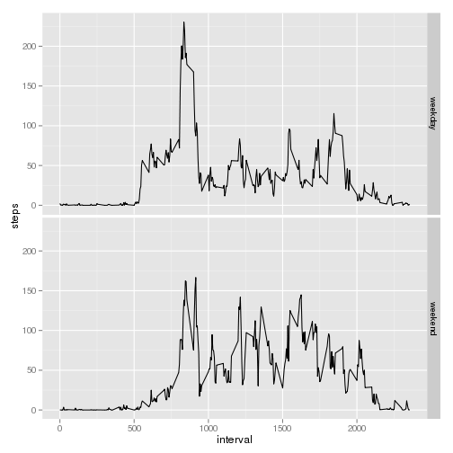

# Reproducible Research: Peer Assessment 1
    
This report, written in R markdown, answers a number of questions
detailed in each section bellow.

The following code sets a global option: always print the code in each code block:
    

## Loading and preprocessing the data

We check to see if we already have the zipped file and download it
otherwise; an extra check avoids uncompressing if the file is already
there (not stictly needed but useful in cases the raw file is changed locally):


```r
### Global variables use throughout
fileUrl <- "https://d396qusza40orc.cloudfront.net/repdata%2Fdata%2Factivity.zip"
datasetZip <- "activity.zip"
activityFile <- "activity.csv"
### Check for zipped dataset file: if it doesn't exist then download it
if (!file.exists(datasetZip)) {
    download.file(fileUrl, destfile=datasetZip, method="curl")
} else {
    print("File already exists, skipping download")
}

### Check for the unzipped filed, and unzip file if either one doesn't exist
if(!file.exists(activityFile)) {
    unzip(zipfile = datasetZip)
} else  {
    print("File already unziped, skipping")
}
```
The CSV file is ingested using `read.csv`:
    

```r
activity <- read.csv(file = "activity.csv", header = T)
```

The only preprocessing done at this stage is to convert the date column to a date object:


```r
activity$date <- as.Date(activity$date, format="%Y-%m-%d")
```

## What is mean total number of steps taken per day?

We build an histogram of the total number of steps taken each day by using the `hist` function:
    

```r
hist(activity$steps, xlab = "Steps", main = "Total number of steps per day")
```

 

The mean:

```r
mean(activity$steps, na.rm = T)
```

```
## [1] 37.38
```

The median:

```r
median(activity$steps, na.rm = T)
```

```
## [1] 0
```

## What is the average daily activity pattern?

A time series plot (i.e. type = "l") of the 5-minute interval
(x-axis) and the average number of steps taken, averaged across all
days (y-axis); we use the base plotting system:


```r
## Aggregate the steps by interval, obtaining the mean.
intervalMean <- aggregate(steps ~ interval, data=activity, FUN=mean)
plot(intervalMean$steps ~  intervalMean$interval, type = "l")
```

 

## Imputing missing values

Calculate and report the total number of missing values in the dataset
(i.e. the total number of rows with NAs)
    

```r
## Obtain both complete and incomplete cases
complete <- activity[complete.cases(activity),]
incomplete <- activity[!complete.cases(activity),]
```

The total number of incomplete cases (i.e. rows with N/A) is
2304 (using `nrow(incomplete)`).

To fill in the missing values the strategy used was to use the mean
value of the intervals (which was already done before):


```r
## Fill missing values by matching the interval
incomplete$steps[incomplete$interval %in% intervalMean$interval] <- intervalMean$steps
```

To create a new dataset -- named `activityComp` -- which is equal to
the original one but with the missing values filled in we add the
recently filled dataset to the complete dataset (which was left
alone):


```r
## "incomplete" is now filled with the interval means, add it to the complete cases
activityComp <- rbind(complete,incomplete)
```
An histogram of the total number of steps taken each day, using the new "filled" dataset:


```r
hist(activityComp$steps, xlab = "Steps", main = "Total number of steps per day")
```

 
 
The mean of the filled dataset:

```r
mean(activityComp$steps)    
```

```
## [1] 37.38
```

The median of the filled dataset:

```r
median(activityComp$steps)    
```

```
## [1] 0
```
    
The values are the same: for the dataset with NAs the mean/med was
37.3826/0,
and for the new dataset which imputed values they are
37.3826/0; data
imputation didn't had an effect on the median and mean of the steps.


## Are there differences in activity patterns between weekdays and weekends?

We create a new column, `weekday`, which at first constains `T` or `FALSE` depending on the date being a weekend, which is then changed to a factor with levels, `weekend` and `weekday`; for this we use the `chron` library and operate on the dataset with filled values:


```r
library(chron)
activityComp$weekday <- is.weekend(activityComp$date)
activityComp$weekday[activityComp$weekday == T] <- "weekend"
activityComp$weekday[activityComp$weekday == FALSE] <- "weekday"
## Convert it to factor
activityComp$weekday <- as.factor(activityComp$weekday)
```

Using the `ggplot2` system we plot the the average number of steps (y) over the interval (x) in two separate panels depending on the weekday:


```r
library(ggplot2)
```

```
## Loading required package: methods
```

```r
## Get the average of steps for each interval and weekday
avgSteps <- aggregate(steps ~ interval + weekday, data=activityComp, FUN=mean)
## Plot it using facets
ggplot(avgSteps,aes(interval, steps)) + geom_line() + facet_grid(weekday ~ .)
```

 
